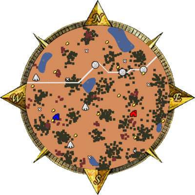
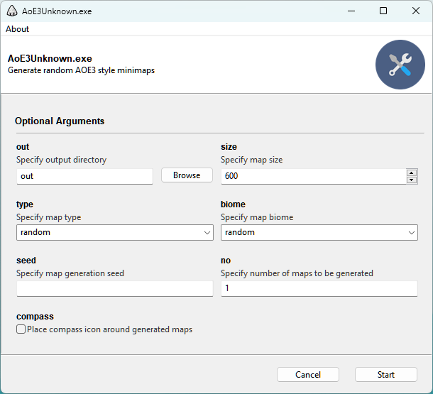

# AoE3Unknown

Expect the unexpected! An Age of Empires 3 style 2D map generator using [Perlin noise](https://www.redblobgames.com/maps/terrain-from-noise/) and [Poisson Disk](https://medium.com/@hemalatha.psna/implementation-of-poisson-disc-sampling-in-javascript-17665e406ce1) techniques.

## Description

Generate AoE3 minimaps which aim to be (somewhat) similar to the maps included in the game. The currently supported map types are the land and island types, with snow, plains, andes, and decan as available biomes.

The Generator uses Perlin noise to generate the island and lake shapes. For placing forests, mines, hunts, and treasures, the Poisson Disk sampling method is used to ensure a minimum distance between the objects of the same type. Other familiar objects such as Town Centers, Trade Routes and Native Settlements are also randomly generated.

## Installation

### Executable

For the Windows platform, a `.exe` executable is available [here](https://github.com//williamcorsel/AoE3Unknown/releases/latest/download/AoE3Unknown.exe), created using the [Gooey](https://github.com/chriskiehl/Gooey) platform. This can be used to adjust the program's parameters and run the program using a GUI.

### Source

Install dependencies using:

```bash
pip install -r requirements.txt
```

This will enable you to use the program in its CLI mode. To use the GUI, also install the [Gooey](https://github.com/chriskiehl/Gooey) package:

```bash
pip install Gooey
```

## Usage

To generate a map using the CLI, run the program as follows:

```bash
python generate.py
```

The generated map will be automatically saved in the `out` subfolder. Additionally, the following flags can be added to the run command:

|Option | Action | Choices | Default |
| --- | --- | --- | --- |
| --out | Specify output directory| str | ./out |
| --size | Specify map size | int | 600 |
| --type | Specify map type | {random, island, land} | random |
| --biome | Specify map biome | {random, snow, plains, andes, decan} | random |
| --seed | Specify map seed | int | None |
| --no | How many maps to generate | int | 1 |
| --compass | Place compass graphic around maps | bool | False |

The same options can also be set using the GUI on windows:


